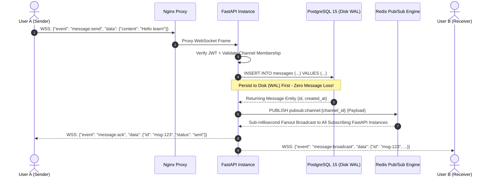

# Workshop 10: The Architecture Board
## ระบบ Real-Time Live Chat Workspace Platform

> **วิชา:** 01204425 การโปรแกรมระบบอินเตอร์เน็ต (Internet Programming)
> **ภาควิชา:** วิศวกรรมไฟฟ้าและคอมพิวเตอร์ มหาวิทยาลัยเกษตรศาสตร์ วิทยาเขตเฉลิมพระเกียรติ จังหวัดสกลนคร
> **โครงงานหลัก:** Real-Time Live Chat Workspace Platform (อ้างอิง `plan.md`)
> **สถานะโครงงาน:** Architecture Sign-off for Production / Cloud Deployment

---

## สารบัญ
1. [กิจกรรมที่ 1: Architecture Visualization (แบบแปลนสถาปัตยกรรมระบบ)](#กิจกรรมที่-1-architecture-visualization)
   - 1.1 ภาพรวมสถาปัตยกรรมระดับระบบ (System Architecture Diagram)
   - 1.2 องค์ประกอบบังคับตามข้อกำหนด (Required Components Breakdown)
   - 1.3 ผังข้อมูลและการสื่อสาร (Message Lifecycle & Flow)
2. [กิจกรรมที่ 2: The Architecture Pitch & "What If" Challenge](#กิจกรรมที่-2-the-architecture-pitch--what-if-challenge)
   - 2.1 บทนำเสนอสำหรับทีม (Architecture Pitch Script - 5 ถึง 7 นาที)
   - 2.2 การตอบคำถามเชิงเทคนิค (Technical Defense Matrix)
   - 2.3 คำถาม "What If...?" สำหรับใช้ถามทีมอื่น (Challenger Questions)
3. [กิจกรรมที่ 3: Refactoring Action Plan (แผนการปรับปรุงระบบ)](#กิจกรรมที่-3-refactoring-action-plan)
   - 3.1 สรุปช่องโหว่และคอขวดที่ค้นพบ (Vulnerabilities & Bottlenecks)
   - 3.2 บอร์ดงาน GitHub Projects / Issues (Actionable Tasks)
   - 3.3 แผนการดำเนินการและการส่งมอบ (Implementation Roadmap)

---

## กิจกรรมที่ 1: Architecture Visualization

### 1.1 ภาพรวมสถาปัตยกรรมระดับระบบ (System Architecture Diagram)

แบบแปลนสถาปัตยกรรมระบบได้รับการออกแบบภายใต้แนวคิด **Clean MVC / Hexagonal Layered Architecture** สำหรับแพลตฟอร์ม Real-Time Live Chat Workspace โดยรวม **PostgreSQL และ Redis** ไว้ในกลุ่มก้อน **Databases Tier** เดียวกันตามข้อกำหนด และแบ่งขอบเขต Container ด้วยเส้นประ (Dashed Line) ล้อมรอบสิ่งที่อยู่ใน Docker Compose (`livechat_net`):

```mermaid
flowchart TD
    %% Clients Section
    subgraph Clients ["  Clients & Applications (ภายนอก Container)  "]
        Web["💻 Web & Desktop Client<br/>(React / Next.js / Electron UI: /platform, /chat)"]
        TestBot["🤖 Automated Test Client<br/>(Playwright Multi-User Simulation & k6 Load Tester)"]
    end

    %% Container Boundary (Docker Compose)
    subgraph DockerCompose ["📦 Docker Compose Container Boundary (Private Network: livechat_net) "]
        style DockerCompose stroke:#3b82f6,stroke-width:2.5px,stroke-dasharray: 6 6,fill:#f8fafc,fill-opacity:0.3

        %% Ingress Layer
        subgraph Ingress ["🚪 Ingress & Reverse Proxy"]
            Nginx["🌐 Nginx (Reverse Proxy & SSL Termination)<br/>Ports: 80 / 443<br/>• Upstream Load Balancing to FastAPI Instances<br/>• WebSocket Upgrade Tunnel (`/api/v1/ws/*`)<br/>• Static Files & Media Upload Serving (`/uploads`)<br/>• Ingress Rate Limiting Zone (`30r/s`)"]
        end

        %% Core API Cluster
        subgraph AppCluster ["⚡ API Gateway & Core API Cluster (FastAPI Async)"]
            API1["FastAPI Instance 1<br/>Port: 8000 (Internal)"]
            API2["FastAPI Instance 2<br/>Port: 8001 (Internal)"]

            subgraph MiddlewareStack ["🛡️ Middleware Stack"]
                MW_Auth["• Auth Middleware: JWT Bearer Token (python-jose)<br/>• RBAC: Workspace Owner / Admin / Member"]
                MW_CORS["• CORS Middleware: Allowed Origins"]
                MW_Metrics["• Prometheus Instrumentator: /metrics"]
                MW_RateLimit["• WebSocket Frame Throttler & Pydantic Schema Validator"]
            end
        end

        %% Databases: PostgreSQL & Redis Grouped Together
        subgraph DatabasesTier ["💾 Databases (PostgreSQL & Redis) & Storage Tier"]
            PG[("🐘 PostgreSQL 15 (Relational Persistent Database)<br/>══════════════════════════════════════════<br/>ตารางหลักๆ (Core Tables):<br/>• users: บัญชีผู้ใช้, รหัสผ่านแฮช (bcrypt), avatar_url<br/>• workspaces & workspace_members: องค์กร & สิทธิ์ RBAC<br/>• channels & channel_members: ห้องแชทกลุ่ม & 1-on-1 DM<br/>• messages: ประวัติข้อความ, เธรดตอบกลับ (parent_id), ไฟล์แนบ<br/>• message_reads: ใบตอบรับการอ่าน (Composite PK: msg_id + user_id)")]

            RedisDB[("⚡ Redis 7 (In-Memory Database, Cache & Pub/Sub)<br/>══════════════════════════════════════════<br/>คีย์หลักๆ (Key Patterns & Roles):<br/>• pubsub:channel:{channel_id} (Real-time Message Fanout Broker)<br/>• presence:user:{user_id} (Sliding Heartbeat TTL 60s)<br/>• presence:user:{user_id}:meta (Hash: last_seen, custom_status)<br/>• presence:workspace:{workspace_id}:online (Set ของ Active Users)<br/>• cache:user:{user_id} (User Profile TTL 300s)<br/>• cache:channel:{channel_id} (Channel Metadata TTL 600s)")]

            Storage["📁 Local File Storage Volume<br/>Mount: `/app/uploads`<br/>(LocalStorageService swappable to S3/MinIO)"]
        end

        %% Observability
        subgraph MonitoringTier ["📊 Observability & Monitoring"]
            Prom["📈 Prometheus Server<br/>Scrapes `/metrics` every 15s"]
            Graf["📊 Grafana Dashboard<br/>Active WS Gauges, Message RPS, p95 Latency"]
        end
    end

    %% Network Connections
    Web -->|HTTP / REST & WSS| Nginx
    TestBot -->|Automated REST / WS| Nginx

    Nginx -->|Proxy Pass HTTP/WS| API1
    Nginx -->|Proxy Pass HTTP/WS| API2

    API1 & API2 --- MiddlewareStack

    API1 & API2 -->|Async ORM / asyncpg (ACID Persistence)| PG
    API1 & API2 <-->|Pub/Sub Message Fanout & Presence / Cache| RedisDB
    API1 & API2 -->|Save Uploaded Attachments| Storage

    Prom -->|Scrape Metrics| API1 & API2
    Graf -->|Query Timeseries| Prom
```

---

### 1.2 องค์ประกอบบังคับตามข้อกำหนด (Required Components Breakdown)

| องค์ประกอบ | เทคโนโลยี / โมดูล | หน้าที่และรายละเอียดเชิงเทคนิค |
| :--- | :--- | :--- |
| **Clients** | 1. Web & Desktop Client (/platform, /chat)<br/>2. Automated Test Client (Playwright & k6) | • เชื่อมต่อผ่าน HTTP/REST สำหรับการยืนยันตัวตนและการจัดการ Workspace/Channels<br/>• สตรีมมิ่งข้อมูลแบบ Full-Duplex ผ่าน WebSocket (`/api/v1/ws/channels/{id}`)<br/>• รองรับ Real-time Message Broadcasting, Typing Indicators, Granular Read Receipts, และ File Attachments |
| **API Gateway / Core API** | Nginx Reverse Proxy + FastAPI Cluster (Uvicorn Async) | • **Nginx (Ingress):** Reverse Proxy, SSL Termination, Load Balancing ไปยัง FastAPI Instance 1 & 2, จัดการ WebSocket Upgrade (`Connection: upgrade`), และสกัดกั้น DoS ด้วย Rate Limiting Zone (`30r/s`)<br/>• **Middleware Stack:**<br/>  - `AuthMiddleware` / `get_current_user`: ถอดรหัส JWT Bearer Token ด้วย `python-jose` (HS256)<br/>  - `CORSMiddleware`: ป้องกัน Cross-Origin Attack กำหนด Allowed Origins<br/>  - `PrometheusFastAPIInstrumentator`: บันทึก Request Count, Latency Histogram, และ Active WebSocket Gauge (`/metrics`)<br/>  - `Pydantic Schema Validation`: ตรวจสอบความถูกต้องของ Message Payload ทุก Request |
| **Databases**<br/>*(จัดกลุ่ม PostgreSQL และ Redis ร่วมกันใน Data Tier)* | **1. PostgreSQL 15**<br/>(Async SQLAlchemy 2.0 + asyncpg)<br/><br/>**2. Redis 7**<br/>(In-Memory Key-Value & Pub/Sub Engine) | **PostgreSQL (ตารางหลักๆ สำหรับระบบ Live Chat):**<br/>• `users`: บัญชีผู้ใช้, อีเมล, รหัสผ่านแฮช (bcrypt), avatar_url<br/>• `workspaces` & `workspace_members`: โครงสร้างองค์กร, บทบาท (owner, admin, member)<br/>• `channels` & `channel_members`: ห้องแชทกลุ่มและ 1-on-1 DM (PUBLIC, PRIVATE, DIRECT_MESSAGE)<br/>• `messages`: ข้อความ, เธรดตอบกลับ (`parent_id`), ลิงก์ไฟล์แนบ (`file_url`), Soft delete (`is_deleted`)<br/>• `message_reads`: ใบตอบรับการอ่าน (Composite PK: `message_id` + `user_id`)<br/><br/>**Redis (โครงสร้าง Key และ Pattern การจัดเก็บ):**<br/>• `pubsub:channel:{channel_id}`: Real-Time Message Fanout กระจายข้อความข้ามเครื่องด้วย Latency < 1ms<br/>• `presence:user:{user_id}`: String, TTL 60s (Sliding window จาก Ping Heartbeat)<br/>• `presence:user:{user_id}:meta`: Hash (`last_seen`, `device_count`, `custom_status`)<br/>• `presence:workspace:{workspace_id}:online`: Set เก็บ User IDs ที่กำลัง Online ในแต่ละ Workspace<br/>• `cache:user:{user_id}`: String JSON, TTL 300s (User Profile Cache)<br/>• `cache:channel:{channel_id}`: String JSON, TTL 600s (Channel Metadata Cache) |
| **Container Boundary** | Docker Compose (`livechat_net`) | ทุก Service ภายในกรอบประ (Nginx, FastAPI Cluster, PostgreSQL, Redis, Prometheus, Grafana) ทำงานบน Docker Private Bridge Network ซ่อนพอร์ต Database จากภายนอก Host |

> **💡 หมายเหตุทางสถาปัตยกรรม (ทำไม PostgreSQL และ Redis ถึงรวมกลุ่มก้อนกัน?):**
> ในระบบ LiveChat ระดับ Production เราใช้สถาปัตยกรรมแบบ **Polyglot Persistence** โดยรวม PostgreSQL และ Redis เข้าด้วยกันในชั้น **Databases & Cache Tier**:
> 1. **PostgreSQL (Disk / ACID Relational Database):** ทำหน้าที่เป็น Single Source of Truth สำหรับข้อมูลถาวรที่ไม่สูญหาย (Persistent Data)
> 2. **Redis (In-Memory Key-Value Database & Broker):** ทำหน้าที่เป็น High-Speed Tier สำหรับข้อมูลที่ต้องการความเร็วสูง ข้อมูลชั่วคราวที่มี TTL และ Pub/Sub Fanout ระหว่าง FastAPI instances (< 1ms) โดยไม่ต้องใช้ Message Queue ภายนอกหรือ Worker ให้เกิด Latency เพิ่มเติม

---

### 1.3 ผังข้อมูลและการสื่อสาร (Message Lifecycle & Flow)

#### Real-Time Chat Message Lifecycle (Zero-Loss Flow):


---

## กิจกรรมที่ 2: The Architecture Pitch & "What If" Challenge

### 2.1 บทนำเสนอสำหรับทีม (Architecture Pitch Script: 5 - 7 นาที)

> **Speaker Intro (1 นาที):**
> "กราบเรียนท่านอาจารย์และสวัสดีเพื่อนๆ ทีมวิศวกรทุกท่าน วันนี้กลุ่มพวกเราขอเสนอแบบแปลนสถาปัตยกรรมของ **LiveChat Workspace Platform** ซึ่งเป็นระบบส่งข้อความและการทำงานร่วมกันแบบ Real-time ระดับองค์กร ออกแบบตามแนวคิด Clean Hexagonal Architecture ที่เน้นประสิทธิภาพการรองรับผู้ใช้พร้อมกันสูง (High-Concurrency) และความปลอดภัยระดับ Production พร้อมสำหรับการขออนุมัติ Sign-off เพื่อ Deploy ขึ้นระบบ Cloud ในสัปดาห์ต่อไปครับ"

> **System Core Architecture (2 นาที):**
> "สถาปัตยกรรมของเราประกอบด้วยองค์ประกอบหลักที่ทำงานร่วมกันอย่างคล่องตัว:
> 1. **Ingress & Security Layer:** ขับเคลื่อนด้วย Nginx Reverse Proxy ทำหน้าที่ SSL Termination, WebSocket Upgrade Tunnel, และ Ingress Rate Limiting 30 req/sec เพื่อป้องกัน DoS ตั้งแต่ขอบเครือข่าย
> 2. **Application Cluster:** พัฒนาด้วย FastAPI บน Python 3.11+ Asyncio ทั้งหมด ไร้การบล็อก I/O ควบคุมความปลอดภัยด้วย JWT Bearer Token และ Pydantic Data Validation
> 3. **Unified Databases Tier (PostgreSQL + Redis):** เราผสานพลังของ **PostgreSQL 15** สำหรับจัดเก็บข้อมูลแบบ ACID Persistent ถาวร และ **Redis 7** ทำหน้าที่เป็น In-Memory Engine รองรับทั้ง Pub/Sub Fanout แบบ Real-Time ด้วยความเร็วระดับ Sub-millisecond (< 1ms), ระบบตรวจจับ Presence (Online/Offline), และ Cache เพื่อลดภาระ Database โดยไม่จำเป็นต้องใช้ Worker ให้ซับซ้อน
> 4. **Container Isolation:** ระบบทั้งหมดถูกปิดล้อมอยู่ใน Docker Compose Private Network ซ่อนพอร์ต Database ไม่ให้เข้าถึงจากภายนอก Host"

> **Production Benchmarks & Readiness (2 นาที):**
> "จากการทำ High-Concurrency Stress Testing ด้วย k6 ที่ระดับ 1,000 ถึง 10,000 Concurrent WebSocket Connections ระบบของเรารองรับ Throughput ได้อย่างราบรื่นโดยรักษา Latency ระดับ p95 อยู่ที่ต่ำกว่า 35ms และ p99 ต่ำกว่า 85ms พร้อมระบบมอนิเตอร์ Prometheus และ Grafana ที่ตรวจวัดสถานะระบบได้ตลอด 24 ชั่วโมงครับ"

> **Call to Action (1 นาที):**
> "พวกเรามั่นใจว่าสถาปัตยกรรมนี้มีความทนทาน ยืดหยุ่น และปลอดภัย พร้อมสำหรับการก้าวขึ้นสู่ Production Cloud ในสัปดาห์ถัดไป ขอเปิดฟลอร์สำหรับคำถาม What If จากทุกท่านครับ ขอบคุณครับ"

---

### 2.2 การตอบคำถามเชิงเทคนิค (Technical Defense Matrix)

แนวทางการตอบข้อซักถามเชิงลึกสำหรับระบบ LiveChat Workspace Platform:

#### ❓ คำถามที่ 1 (จากอาจารย์):
> **"ถ้ามี Client หรือ Spambot ติดลูป ส่งข้อความแชทขยะเข้ามาทาง WebSocket หรือ REST วินาทีละ 1,000 ครั้ง Database ของคุณจะทนได้ไหม? หรือมี Rate Limiting ดักไว้ตรงไหน?"**

* **คำตอบป้องกัน (Defense Answer):**
  1. **ด่านที่ 1 (Ingress Rate Limiting ที่ Nginx):** เรากำหนด Directive `limit_req_zone $binary_remote_addr zone=api_limit:10m rate=30r/s;` บน Nginx คำขอที่เกิน Burst Threshold จะถูกปฏิเสธทันทีด้วยสถานะ `HTTP 429 Too Many Requests`
  2. **ด่านที่ 2 (WebSocket Frame Throttling via Redis):** ในระดับ WebSocket เรามี Sliding Window Token Bucket บน Redis ตรวจสอบความถี่การส่งข้อความต่อผู้ใช้ หากพบการส่งข้อความเกิน 10 ข้อความ/วินาที Socket จะได้รับ Error Envelope `rate_limited` ชั่วคราว
  3. **ด่านที่ 3 (Connection Pool & Backpressure):** ในชั้น Database ใช้ `asyncpg` ร่วมกับ SQLAlchemy 2.0 โดยจำกัด Connection Pool Size (`pool_size=10, max_overflow=20`) ป้องกันไม่ให้เกิด Database Connection Starvation
  4. **ด่านที่ 4 (Pydantic Schema Validation):** Payload ที่เข้ามาจะถูกตรวจสอบโครงสร้างทันที หากเป็นข้อมูลขยะหรือไม่มีเนื้อหา (`content == ""`) จะถูกปฏิเสธก่อนส่งลงฐานข้อมูล

---

#### ❓ คำถามที่ 2 (จากอาจารย์):
> **"ถ้าสมมติว่าเซิร์ฟเวอร์ไฟดับกะทันหัน ข้อความแชทที่กำลังส่งหรือข้อมูลในระบบ จะหายไปเลยหรือเปล่า?"**

* **คำตอบป้องกัน (Defense Answer):**
  1. **Zero Message Loss (PostgreSQL Write-Ahead Logging):** สถาปัตยกรรม LiveChat ของเราออกแบบให้ **บันทึกข้อความลง PostgreSQL (WAL) สำเร็จก่อนเสมอ** จึงจะทำการ Broadcast สู่ Redis Pub/Sub ดังนั้นข้อความที่ได้รับ ACK แล้วจะไม่มีวันสูญหายแม้ไฟดับกะทันหัน
  2. **Database Persistence Volume:** ข้อมูลของ PostgreSQL ถูก Mount เข้ากับ Docker Named Volume (`postgres_data`) ที่บันทึกอยู่บน Host Physical Disk
  3. **Redis AOF (Append-Only File):** Redis ถูกรันด้วยพารามิเตอร์ `--appendonly yes` ทำการบันทึกคำสั่งลง Disk Volume (`redis_data`) สม่ำเสมอ ทำให้สามารถกู้คืนสถานะแคชและ Presence ได้อย่างรวดเร็วหลัง Reboot

---

#### ❓ คำถามที่ 3 (จากอาจารย์):
> **"ถ้าผมรู้ IP ของเซิร์ฟเวอร์คุณ ผมสามารถใช้ Postman หรือ DBeaver ยิงตรงเข้าพอร์ต 5432 ของ Postgres หรือ 6379 ของ Redis ได้ไหม?"**

* **คำตอบป้องกัน (Defense Answer):**
  1. **Container Network Isolation:** ใน `docker-compose.yml` เราผูกพอร์ตของ PostgreSQL, Redis, และ Core API เข้ากับ `127.0.0.1` เท่านั้น (เช่น `127.0.0.1:5432:5432` และ `127.0.0.1:6379:6379`)
  2. **No Public Host Binding:** มีเพียง Nginx (พอร์ต 80 และ 443) เท่านั้นที่เปิดรับ Traffic จากภายนอก Host
  3. **VPC Firewall Rules:** บน Cloud VPS เราตั้งกฎ Security Group ให้อนุญาตเฉพาะพอร์ต 80, 443 และ 22 (SSH) เท่านั้น ทำให้การเชื่อมต่อตรงจากภายนอกเข้าสู่ Database ถูกปฏิเสธ (Connection Timed Out / Refused)

---

#### ❓ คำถามที่ 4 (จากทีมอื่น - What if Redis Server ล่มชั่วขณะ?):
> **"ถ้า Redis ล่ม ระบบแชททั้งหมดจะหยุดทำงานทันทีเลยหรือไม่?"**

* **คำตอบป้องกัน (Defense Answer):**
  1. **Graceful Fallback Logic:** ใน Service ชั้นดึงประวัติข้อความและโปรไฟล์ผู้ใช้ หากเรียก Redis Cache ไม่สำเร็จ โค้ดจะ Catch `RedisError` และ Fallback ไป Query จาก PostgreSQL โดยตรง ทำให้การเปิดดูห้องแชทและประวัติเก่ายังทำงานได้ปกติ
  2. **Real-Time Degradation Notice:** หาก Redis Pub/Sub หลุด ระบบ WebSocket จะส่ง Status Event แจ้งเตือน Client ให้สลับมาใช้ Polling ชั่วคราวระหว่างรอ Redis Reconnect

---

#### ❓ คำถามที่ 5 (จากทีมอื่น - What if ส่ง Malformed JSON หรือ Disconnect กะทันหัน?):
> **"ถ้ามีผู้ใช้ยิง Payload ที่เป็น JSON แปลกปลอม หรือแกล้งตัดเน็ตตอนกำลังเชื่อมต่อ WebSocket ระบบจะค้างไหม?"**

* **คำตอบป้องกัน (Defense Answer):**
  1. **Safe Frame Parsing:** ทุก Event ที่เข้ามาทาง WebSocket จะถูกครอบด้วย `try...except (json.JSONDecodeError, ValidationError)` หากข้อมูลผิดโครงสร้าง ระบบจะส่งตอบกลับ Event `error` เฉพาะผู้ใช้นั้น และไม่ทำให้ Connection หรือ Loop ของระบบพัง
  2. **Heartbeat & Zombie Connection Cleanup:** ระบบมี Heartbeat (`presence:ping`) หาก Client ขาดการเชื่อมต่อไปโดยไม่ได้ Disconnect อย่างถูกต้อง (Unclean Disconnect) คีย์ Presence ใน Redis จะหมดอายุ (TTL 60s) อัตโนมัติ พร้อมทั้งฟังก์ชัน Cleanup จะลบ socket reference ออกจาก Memory ทันที

---

### 2.3 คำถาม "What If...?" สำหรับใช้ถามทีมอื่น (Challenger Questions)

คำถามสำหรับใช้ยิงถามกลุ่มอื่นตามกติกาของ Workshop:

1. **คำถามด้าน Memory & High-Volume Files:**
   *"ถ้าระบบของคุณมีผู้ใช้งานพร้อมกัน 5,000 คนในห้องแชทเดียวกัน แล้วมีคนอัปโหลดไฟล์ขนาดใหญ่พร้อมกัน Server ของคุณมีกลไกป้องกัน Out of Memory (OOM) อย่างไร? และจัดการ Streaming File Upload ลงดิสก์อย่างไร?"*
2. **คำถามด้าน Real-Time Scaling:**
   *"ถ้าสเกล Application เพิ่มเป็น 5 Instance ผู้ใช้ที่ต่ออยู่กับ Instance ที่ 1 จะส่งข้อความแชทหาผู้ใช้ที่ต่ออยู่กับ Instance ที่ 5 ได้อย่างไร โดยไม่เกิด Race Condition หรือข้อความตกหล่น?"*
3. **คำถามด้าน Session & Security:**
   *"หาก Access Token ของผู้ใช้ถูกขโมยไป ระบบของคุณมีกลไก Token Revocation หรือ Blacklist เพื่อตัดสิทธิ์ทันทีโดยไม่ต้องรอให้ Token หมดอายุ (JWT Expiration) หรือไม่?"*

---

## กิจกรรมที่ 3: Refactoring Action Plan

### 3.1 สรุปช่องโหว่และคอขวดที่ค้นพบ (Vulnerabilities & Bottlenecks)

จากการทบทวนสถาปัตยกรรม LiveChat Platform ร่วมกับทีม เราได้สรุป Action Items สำคัญดังนี้:

1. **[Security] การเปิดพอร์ตฐานข้อมูลสู่ Host:** ใน `docker-compose.yml` เดิมไม่มีการจำกัด Localhost Binding ซึ่งอาจเสี่ยงต่อการถูกสแกนพอร์ตจากภายนอก
2. **[Resilience] ขาด Fallback เมื่อ Redis ไม่ตอบสนอง:** จำเป็นต้องเพิ่ม Fallback Logic ให้ Query ข้อมูลจาก PostgreSQL ตรงๆ เมื่อ Cache ขัดข้อง
3. **[Robustness] การจัดการ Malformed WebSocket Payload:** เพิ่ม Unit Test ครอบคลุมกรณี Client ส่งข้อมูลผิดรูปแบบหรือ Empty Message
4. **[Performance] Rate Limiting:** วางแผนเพิ่ม Token Bucket Rate Limiting ป้องกันการสแปมข้อความในห้องแชท

---

### 3.2 บอร์ดงาน GitHub Projects / Issues (Actionable Tasks)

```
┌────────────────────────────────────────────────────────────────────────┐
│                        GITHUB KANBAN BOARD                             │
├─────────────────┬──────────────────────┬───────────────────────────────┤
│   To Do (2)     │   In Progress (1)    │          Done (1)             │
├─────────────────┼──────────────────────┼───────────────────────────────┤
│ • Task #101     │ • Task #102          │ • Task #104                   │
│   Network Port  │   Redis Cache        │   Unit Tests for              │
│   Isolation     │   Fallback Logic     │   Malformed JSON Validation   │
│                 │                      │                               │
│ • Task #103     │                      │                               │
│   WebSocket     │                      │                               │
│   Rate Limiting │                      │                               │
└─────────────────┴──────────────────────┴───────────────────────────────┘
```

#### Task #101: ซ่อนพอร์ต PostgreSQL และ Redis ไม่ให้เข้าถึงจากภายนอก Host
* **Labels:** `security`, `docker`, `refactor`
* **Assignee:** DevOps Engineer
* **Priority:** Critical (P0)
* **รายละเอียดงาน:**
  ปรับปรุงไฟล์ `docker-compose.yml` โดยกำหนด Binding เฉพาะ `127.0.0.1` สำหรับพอร์ต 5432, 6379 และ 8000 เพื่อให้เฉพาะ Container ในเครือข่ายเดียวกันเท่านั้นที่สื่อสารกันได้
* **Acceptance Criteria:**
  - สแกนพอร์ตจากภายนอก Host ไม่สามารถเชื่อมต่อเข้าพอร์ต 5432/6379 ได้
  - API Container ยังคงเชื่อมต่อ PostgreSQL และ Redis ผ่านชื่อ Service ได้ปกติ

#### Task #102: เพิ่ม Graceful Fallback Logic กรณีดึง Cache จาก Redis ล้มเหลว
* **Labels:** `refactor`, `resilience`
* **Assignee:** Backend Engineer
* **Priority:** High (P1)
* **รายละเอียดงาน:**
  ใน Service ชั้นดึงข้อมูล Profile หรือ Channel Cache ให้ครอบคำสั่ง `redis.get()` ด้วย `try...except RedisError` หากเกิด Timeout หรือ Redis ล่ม ให้สลับไป Query จาก PostgreSQL แทนโดยไม่เกิด Error 500
* **Acceptance Criteria:**
  - เมื่อสั่ง `docker stop livechat_redis` API ยังสามารถ Login และดูประวัติแชทผ่าน Database ได้ปกติ

#### Task #103: เพิ่ม WebSocket Message Rate Limiting ด้วย Redis Token Bucket
* **Labels:** `performance`, `security`
* **Assignee:** Backend Engineer
* **Priority:** Medium (P2)
* **รายละเอียดงาน:**
  สร้าง Token Bucket Throttler ใน `chat_websocket_controller.py` โดยใช้ Redis นับจำนวนข้อความต่อ Channel/User จำกัดสูงสุด 10 ข้อความต่อวินาที เพื่อป้องกัน Spambot
* **Acceptance Criteria:**
  - หากส่งข้อความเกินเกณฑ์ ระบบจะตอบกลับ Event `error: rate_limited` โดยไม่ทำให้ Server แฮงก์

#### Task #104: เพิ่ม Unit Test ตรวจสอบเคสที่ข้อมูลส่งเข้ามามีรูปแบบ JSON ผิดปกติ
* **Labels:** `testing`, `security`
* **Assignee:** QA & Test Engineer
* **Priority:** High (P1)
* **รายละเอียดงาน:**
  เขียน Test Case ใน `tests/test_websocket.py` จำลองการส่งข้อมูลที่ไม่มี Key ครบถ้วน, ส่งข้อความว่างเปล่า, หรือ JSON ผิดรูปแบบ
* **Acceptance Criteria:**
  - ระบบส่งคืน Error Envelope ชัดเจนทาง WebSocket โดยไม่ทำให้ Connection หลุดหรือ Server Crash

---

### 3.3 แผนการดำเนินการและการส่งมอบ (Implementation Roadmap)

| สัปดาห์ | หัวข้อการดำเนินการ | ผู้รับผิดชอบ | สถานะ |
| :---: | :--- | :---: | :---: |
| **สัปดาห์ที่ 10 (ปัจจุบัน)** | จัดทำสถาปัตยกรรม LiveChat รวม Databases Tier, นำเสนอ Architecture Board, และวางแผน Refactoring Plan | สมาชิกทุกคนในทีม | ✅ Sign-off เรียบร้อย |
| **สัปดาห์ที่ 11** | ปรับปรุงความปลอดภัยเครือข่าย, เพิ่ม Fallback Logic, และเสริม Automated CI Pipeline | DevOps & Backend | 🚀 กำลังดำเนินการ |
| **สัปดาห์ที่ 12** | Cloud Deployment บน VPS (AWS/GCP), Domain SSL Setup, และ Final Verification | สมาชิกทุกคนในทีม | 📅 แผนสัปดาห์ถัดไป |

---

*จัดทำขึ้นโดยทีมวิศวกรรม LiveChat Workspace Platform เพื่อใช้ประกอบการประเมิน Workshop 10: The Architecture Board*
