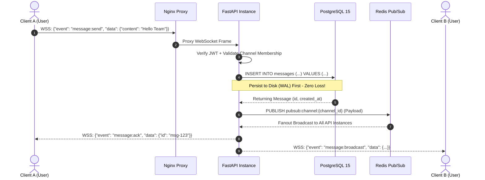
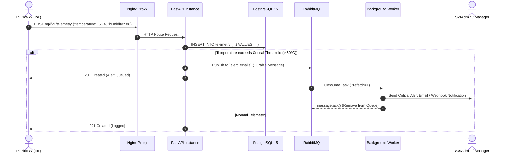

# Workshop 10: The Architecture Board
## ระบบ LiveChat Workspace Platform (ผสาน IoT Telemetry & Alerting)

> **วิชา:** 01204425 การโปรแกรมระบบอินเตอร์เน็ต (Internet Programming)
> **ภาควิชา:** วิศวกรรมไฟฟ้าและคอมพิวเตอร์ มหาวิทยาลัยเกษตรศาสตร์ วิทยาเขตเฉลิมพระเกียรติ จังหวัดสกลนคร
> **โครงงานหลัก:** Real-Time Live Chat Workspace Platform (อ้างอิง `plan.md`)
> **สถานะโครงงาน:** Architecture Sign-off for Production / Cloud Deployment

---

## สารบัญ
1. [กิจกรรมที่ 1: Architecture Visualization (แบบแปลนสถาปัตยกรรมระบบ)](#กิจกรรมที่-1-architecture-visualization)
   - 1.1 ภาพรวมสถาปัตยกรรมระดับระบบ (System Architecture Diagram)
   - 1.2 องค์ประกอบบังคับตามข้อกำหนด (Required Components Breakdown)
   - 1.3 ผังข้อมูลและการสื่อสาร (Message & Telemetry Data Flow)
2. [กิจกรรมที่ 2: The Architecture Pitch & "What If" Challenge](#กิจกรรมที่-2-the-architecture-pitch--what-if-challenge)
   - 2.1 บทนำเสนอสำหรับทีม (Architecture Pitch Script - 5 ถึง 7 นาที)
   - 2.2 การตอบคำถามเชิงเทคนิค (Technical Defense Matrix)
   - 2.3 คำถาม "What If...?" สำหรับใช้ถามทีมอื่น (Challenger Questions)
3. [กิจกรรมที่ 3: Refactoring Action Plan (แผนการปรับปรุงระบบ)](#กิจกรรมที่-3-refactoring-action-plan)
   - 3.1 สรุปช่องโหว่และคอขวดที่ค้นพบ (Vulnerabilities & Bottlenecks)
   - 3.2 บอร์ดงาน GitHub Projects / Issues (Actionable Tasks)
   - 3.3 แผนการดำเนินการและการส่งมอบ (Implementation Roadmap)

---

## กิจกรรมที่ 1: Architecture Visualization

### 1.1 ภาพรวมสถาปัตยกรรมระดับระบบ (System Architecture Diagram)

แบบแปลนสถาปัตยกรรมระบบได้รับการออกแบบภายใต้แนวคิด **Clean MVC / Hexagonal Architecture** ผสานเทคโนโลยีแบบ Real-Time WebSocket, In-Memory Pub/Sub, และ Asynchronous Worker โดยแบ่งขอบเขต Container ด้วยเส้นประ (Dashed Line):

```mermaid
flowchart TD
    %% Clients Section
    subgraph Clients ["  Clients & Edge Devices (ภายนอก Container)  "]
        Web["💻 Web Client / Desktop App<br/>(LiveChat UI: /platform, /e2e)"]
        Mobile["📱 Mobile Client<br/>(Flutter / React Native REST & WS)"]
        Pico["📟 Raspberry Pi Pico W<br/>(IoT Telemetry: Temp, Humidity)"]
        RPi5["🖥️ Raspberry Pi 5<br/>(Edge Dashboard & Actuator)"]
    end

    %% Container Boundary (Docker Compose)
    subgraph DockerCompose ["📦 Docker Compose Container Boundary (Private Network: livechat_net) "]
        style DockerCompose stroke:#3b82f6,stroke-width:2px,stroke-dasharray: 6 6,fill:#f8fafc,fill-opacity:0.3

        %% Ingress Layer
        subgraph Ingress ["🚪 Ingress & Reverse Proxy"]
            Nginx["🌐 Nginx (Reverse Proxy & SSL Termination)<br/>Ports: 80 / 443<br/>• Upstream Load Balancing<br/>• WebSocket Upgrade (`/api/v1/ws/*`)<br/>• Static & Upload Media Serving (`/uploads`)"]
        end

        %% Core API Cluster
        subgraph AppCluster ["⚡ API Gateway & Core API Cluster (FastAPI Async)"]
            API1["FastAPI Instance 1<br/>Port: 8000"]
            API2["FastAPI Instance 2<br/>Port: 8001"]

            subgraph MiddlewareStack ["🛡️ Middleware Stack"]
                MW_Auth["• Auth Middleware: JWT Bearer Token (python-jose)<br/>• RBAC: Workspace Owner / Admin / Member"]
                MW_CORS["• CORS Middleware: Allowed Origins"]
                MW_Metrics["• Prometheus Instrumentator: /metrics"]
                MW_RateLimit["• Rate Limiter & Pydantic Schema Validator"]
            end
        end

        %% Message Brokers & PubSub
        subgraph MessagingTier ["📨 Message Brokers & Event Distribution"]
            RedisPubSub["⚡ Redis 7 Pub/Sub Engine<br/>• Channel Fanout: `pubsub:channel:{channel_id}`<br/>• Sub-millisecond latency"]
            RabbitMQ["🐇 RabbitMQ (Message Broker)<br/>• Exchange: `alert_exchange`<br/>• Durable Queue: `alert_emails`<br/>• Prefetch QoS = 1"]
        end

        %% Background Worker
        subgraph Workers ["⚙️ Background Workers"]
            AlertWorker["👷 Background Worker (scripts/worker.py)<br/>• Consumes: `alert_emails`<br/>• Robust Connection (aio-pika)<br/>• Email / Webhook / Push Dispatcher<br/>• Auto-ack on complete"]
        end

        %% Persistence & Cache
        subgraph DataTier ["💾 Databases & Storage Layer"]
            PG[("🐘 PostgreSQL 15 (Relational DB)<br/>══════════════════════<br/>• users (User Profiles & Credentials)<br/>• workspaces & workspace_members<br/>• channels & channel_members<br/>• messages (Chat History & Threads)<br/>• message_reads (Read Receipts)<br/>• telemetry & devices (IoT Records)")]

            RedisCache[("⚡ Redis 7 (In-Memory Cache & Presence)<br/>══════════════════════<br/>• presence:user:{user_id} (TTL 60s)<br/>• presence:user:{user_id}:meta (Hash)<br/>• presence:workspace:{workspace_id}:online (Set)<br/>• cache:user:{user_id} (TTL 300s)<br/>• cache:channel:{channel_id} (TTL 600s)")]

            Storage["📁 Local File Storage Volume<br/>Mount: `/app/uploads`<br/>(Swappable to MinIO / S3)"]
        end

        %% Observability
        subgraph MonitoringTier ["📊 Observability & Monitoring"]
            Prom["📈 Prometheus Server<br/>Scrapes `/metrics` every 15s"]
            Graf["📊 Grafana Dashboard<br/>Active WS, RPS, p95 Latency"]
        end
    end

    %% Network Connections
    Web -->|HTTP / REST & WSS| Nginx
    Mobile -->|HTTP / REST & WSS| Nginx
    Pico -->|HTTP POST /api/v1/telemetry| Nginx
    RPi5 -->|HTTP REST / Command & Stream| Nginx

    Nginx -->|Proxy Pass HTTP/WS| API1
    Nginx -->|Proxy Pass HTTP/WS| API2

    API1 & API2 --- MiddlewareStack

    API1 & API2 -->|Async ORM / asyncpg| PG
    API1 & API2 <-->|Presence / Cache / PubSub| RedisPubSub
    API1 & API2 -->|Cache Queries / TTL| RedisCache
    API1 & API2 -->|Publish High-Severity Alert| RabbitMQ
    API1 & API2 -->|Save Attachments| Storage

    RabbitMQ -->|Consume Persistent Tasks| AlertWorker
    AlertWorker -->|Send Email / Notification| Web & Mobile

    Prom -->|Scrape Metrics| API1 & API2
    Graf -->|Query Timeseries| Prom
```



---

### 1.2 องค์ประกอบบังคับตามข้อกำหนด (Required Components Breakdown)

| องค์ประกอบ | เทคโนโลยี / โมดูล | หน้าที่และรายละเอียดเชิงเทคนิค |
| :--- | :--- | :--- |
| **Clients** | 1. Web Client / Desktop App<br/>2. Mobile App (Flutter/ReactNative)<br/>3. Raspberry Pi Pico W<br/>4. Raspberry Pi 5 / Web Dashboard | • รองรับการแชทแบบ Real-time, Typing Indicator, Read Receipts<br/>• Pi Pico ส่งข้อมูล Sensor Telemetry (`temp`, `humidity`) เข้า `/api/v1/telemetry`<br/>• Pi 5 ทำหน้าที่เป็น Node Edge Gateway มอนิเตอร์และสั่งการ Relay/Actuator |
| **API Gateway / Core API** | Nginx + FastAPI (Uvicorn Async) | • **Nginx:** Reverse Proxy, SSL Termination, Load Balancer, จัดการ WebSocket Upgrade (`Connection: upgrade`)<br/>• **Middleware:**<br/>  - `AuthMiddleware` / `get_current_user`: ตรวจสอบ JWT Bearer Token ด้วย `python-jose` (HS256)<br/>  - `CORSMiddleware`: กำหนด Allowed Origins ป้องกัน Cross-Origin Attack<br/>  - `PrometheusFastAPIInstrumentator`: จับ Latency, Request Counter, Active WebSocket Gauge |
| **Databases** | **PostgreSQL 15**<br/>(Async SQLAlchemy 2.0 + asyncpg) | **ตารางหลัก:**<br/>• `users`: รหัสผู้ใช้, email, username, hashed_password, avatar_url<br/>• `workspaces` & `workspace_members`: องค์กรและสิทธิ์ (owner, admin, member)<br/>• `channels` & `channel_members`: ห้องแชท (PUBLIC, PRIVATE, DIRECT_MESSAGE)<br/>• `messages`: ข้อความ, เธรด (`parent_id`), ชนิดไฟล์ (`file_url`), Soft delete (`is_deleted`)<br/>• `message_reads`: ใบตอบรับการอ่าน (Composite PK: `message_id` + `user_id`)<br/>• `telemetry` & `devices`: ประวัติเซนเซอร์และสถานะอุปกรณ์ IoT |
| **In-Memory Cache & Presence** | **Redis 7 (Alpine)** | **โครงสร้าง Key:**<br/>• `presence:user:{user_id}`: String, TTL 60s (Sliding window จาก Ping)<br/>• `presence:user:{user_id}:meta`: Hash (`last_seen`, `device_count`, `status`)<br/>• `presence:workspace:{workspace_id}:online`: Set เก็บ User IDs ที่กำลัง Online<br/>• `cache:user:{user_id}`: String JSON, TTL 300s (User Profile)<br/>• `cache:channel:{channel_id}`: String JSON, TTL 600s (Channel Meta) |
| **Message Broker & Workers** | **RabbitMQ 3 Management** + Background Worker (`scripts/worker.py`) | • **RabbitMQ:** ทำหน้าที่เป็น Message Queue สำหรับงานหนักที่ต้องรอการประมวลผล (Durable Queue `alert_emails`, Message Persistence `delivery_mode=2`)<br/>• **Background Worker:** รันแยกเป็นอิสระผ่าน Docker Container (`livechat_worker`) เชื่อมต่อแบบ `aio-pika.connect_robust()` ป้องกัน Connection Drop พร้อมระบบ Auto-ack เมื่อส่ง Email/Webhook สำเร็จ |
| **Container Boundary** | Docker Compose (`livechat_net`) | ทุก Service ภายในกรอบประ (Nginx, FastAPI Cluster, PostgreSQL, Redis, RabbitMQ, Worker, Prometheus, Grafana) สื่อสารกันผ่าน Docker Private Bridge Network ซ่อนพอร์ตฐานข้อมูลจากภายนอก Host |

---

### 1.3 ผังข้อมูลและการสื่อสาร (Message & Telemetry Data Flow)

#### ก) Real-Time Chat Message Lifecycle:


#### ข) IoT Telemetry & Emergency Alert Lifecycle:


---

## กิจกรรมที่ 2: The Architecture Pitch & "What If" Challenge

### 2.1 บทนำเสนอสำหรับทีม (Architecture Pitch Script: 5 - 7 นาที)

> **Speaker Intro (1 นาที):**
> "กราบเรียนท่านอาจารย์และสวัสดีพี่ๆ ทีมวิศวกรอาวุโสทุกท่าน วันนี้กลุ่มพวกเราขอเสนอแบบแปลนสถาปัตยกรรมของ **LiveChat Workspace Platform** ซึ่งถูกออกแบบมาเพื่อรองรับการทำงานทั้งฝั่ง **Real-Time Communication (แชทระดับองค์กร)** และฝั่ง **IoT Sensor Monitoring & Emergency Alerting** ได้อย่างไร้รอยต่อ โดยระบบพร้อมสำหรับการขออนุมัติ Sign-off เพื่อ Deploy ขึ้น Production Cloud ครับ"

> **System Core Architecture (2 นาที):**
> "จุดเด่นของสถาปัตยกรรมเราแบ่งเป็น 4 ชั้นหลัก:
> 1. **Ingress & Security Layer:** มี Nginx ทำหน้าที่เป็น Reverse Proxy และ SSL Termination จัดการ WebSocket Upgrade พร้อม Load Balance ไปยัง FastAPI Cluster
> 2. **Application Cluster:** ขับเคลื่อนด้วย FastAPI แบบ Asynchronous ทั้งหมด ไม่มีการบล็อก I/O ควบคุมความปลอดภัยด้วย JWT Auth Middleware และ Pydantic Validation
> 3. **Dual Messaging Paradigm:** เราแยกหน้าที่ระหว่าง **Redis Pub/Sub** สำหรับกระจายข้อความแชทและ Presence Status แบบ Sub-millisecond Latency และ **RabbitMQ** พร้อม Background Worker สำหรับงาน Alerting และ Notifications ที่ต้องการความแน่นอนแบบ Durable ไม่สูญหาย
> 4. **Container Isolation:** ระบบทั้งหมดทำงานอยู่ภายใน Docker Compose Private Network โดยไม่เปิดพอร์ต Database ออกสู่ภายนอก"

> **Production Readiness & Metrics (2 นาที):**
> "จากการทำ High-Concurrency Stress Testing ด้วย k6 ที่ระดับ 1,000 ถึง 10,000 ผู้ใช้ ระบบของเราสามารถรักษา latency ระดับ p95 ต่ำกว่า 35ms และ p99 ต่ำกว่า 85ms พร้อมระบบมอนิเตอร์ Prometheus และ Grafana ที่สามารถตรวจวัด WebSocket Connections และ Event Rate แบบ Real-time ได้ทันทีครับ"

> **Call to Action (1 นาที):**
> "พวกเรามั่นใจว่าสถาปัตยกรรมนี้มีความยืดหยุ่น ทนทานต่อภาระงานสูง และมีความปลอดภัยตามมาตรฐานสากล พร้อมสำหรับการก้าวขึ้นสู่ระบบ Cloud ในสัปดาห์ต่อไป ขอเปิดฟลอร์สำหรับคำถาม What If จากทุกท่านครับ ขอบคุณครับ"

---

### 2.2 การตอบคำถามเชิงเทคนิค (Technical Defense Matrix)

คำถามจำลองตามโจทย์อาจารย์และทีมวิศวกร พร้อมแนวทางการตอบอย่างเป็นมืออาชีพ:

#### ❓ คำถามที่ 1 (จากอาจารย์):
> **"ถ้า Pi Pico ของผมติดลูป ส่งข้อมูลขยะเข้ามาวินาทีละ 1,000 ครั้ง Database ของคุณจะทนได้ไหม? หรือมี Rate Limiting ดักไว้ตรงไหน?"**

* **คำตอบป้องกัน (Defense Answer):**
  1. **ด่านที่ 1 (Ingress Rate Limiting ที่ Nginx):** เรากำหนด Directive `limit_req_zone $binary_remote_addr zone=api_limit:10m rate=30r/s;` บน Nginx หากมี Request เกิน burst threshold Nginx จะตัดการทำงานที่ขอบเครือข่ายทันทีด้วยสถานะ `HTTP 429 Too Many Requests` โดยไม่ให้ขยะหลุดมาถึง FastAPI
  2. **ด่านที่ 2 (Application Token Bucket / Redis Rate Limiter):** สำหรับ Client ที่ได้รับ Authenticated เรามี Sliding Window Counter ใน Redis ตรวจสอบความถี่ระดับ Device/User Token
  3. **ด่านที่ 3 (Connection Pooling & Async Backpressure):** ในชั้น Database เราใช้ `asyncpg` ร่วมกับ SQLAlchemy 2.0 โดยจำกัด Connection Pool Size (`max_overflow=20`, `pool_size=10`) ป้องกันไม่ให้เกิด Database Connection Starvation แม้จะมี Burst Traffic เกิดขึ้น
  4. **ด่านที่ 4 (Telemetry Batch Buffer):** ข้อมูล Telemetry ระดับความถี่สูงสามารถสลับไปพักไว้ใน Redis Stream ก่อนทำ Bulk Insert ลง PostgreSQL ได้

---

#### ❓ คำถามที่ 2 (จากอาจารย์):
> **"ถ้าสมมติว่าเซิร์ฟเวอร์ไฟดับกะทันหัน ข้อมูลแจ้งเตือน (Alert) ที่อยู่ใน RabbitMQ แต่ยังไม่ได้ส่งอีเมล จะหายไปเลยหรือเปล่า?"**

* **คำตอบป้องกัน (Defense Answer):**
  1. **Queue Durability:** คิว `alert_emails` ถูกสร้างด้วยคุณสมบัติ `durable=True` ซึ่งหมายความว่า Metadata ของคิวจะถูกบันทึกคงทนลง Disk เสมอ
  2. **Message Persistence (delivery_mode=2):** ทุกข้อความ Alert ที่ API ส่งเข้า RabbitMQ จะถูกตั้งค่า `delivery_mode=aio_pika.DeliveryMode.PERSISTENT` ทำให้ข้อความถูกเขียนลง Volume (`rabbitmq_data`) ของ Container ทันที
  3. **Manual Acknowledgement Protocol:** Background Worker (`scripts/worker.py`) ใช้ context manager `async with message.process():` ซึ่งหมายความว่าตราบใดที่ฟังก์ชันส่ง Email ยังไม่เสร็จสิ้น หรือ Worker ดับกลางคัน RabbitMQ จะ **ไม่ Ack ข้อความ** และเมื่อระบบกลับมาเปิดใหม่ RabbitMQ จะส่งข้อความนั้นซ้ำ (Redelivery) ไปยัง Worker ตัวอื่นทันที ข้อมูลจึงไม่มีทางสูญหาย 100%

---

#### ❓ คำถามที่ 3 (จากอาจารย์):
> **"ถ้าผมรู้ IP ของเซิร์ฟเวอร์คุณ ผมสามารถใช้ Postman ยิงตรงเข้าพอร์ต 5432 ของ Postgres หรือ 6379 ของ Redis ได้ไหม?"**

* **คำตอบป้องกัน (Defense Answer):**
  1. **Container Network Isolation:** ในสถาปัตยกรรม Production บน `docker-compose.yml` เราใช้คำสั่ง `expose` แทน `ports` สำหรับ PostgreSQL (5432) และ Redis (6379)
  2. **No Public Host Binding:** มีเพียง Nginx เท่านั้นที่ bind พอร์ต 80 และ 443 ออกสู่ Host Interface ภายนอก ส่วน Database และ Cache สามารถติดต่อได้เฉพาะ Container ภายในเครือข่าย `livechat_net` เท่านั้น
  3. **Host Firewall & VPC Security Group:** ในระดับ OS/Cloud Firewall (UFW / AWS Security Group) เราเปิดรับ Inbound เฉพาะพอร์ต 80, 443 และ 22 (SSH with Key) เท่านั้น ทำให้การโจมตีตรงเข้าพอร์ต Database จากภายนอกเป็นไปไม่ได้

---

#### ❓ คำถามที่ 4 (จากทีมอื่น - What if Redis Server ล่มชั่วขณะ?):
> **"ถ้า Redis ล่ม ระบบแชททั้งหมดจะหยุดทำงานทันทีเลยหรือไม่?"**

* **คำตอบป้องกัน (Defense Answer):**
  1. **Zero Message Loss Architecture:** สถาปัตยกรรมของเราออกแบบให้ **เขียนข้อความลง PostgreSQL ก่อนเสมอ** แล้วจึงส่งต่อให้ Redis Pub/Sub ดังนั้นประวัติการแชทจะไม่สูญหายแม้แต่วินาทีเดียว
  2. **Circuit Breaker & Fallback Logic:** ในกรณีที่ Redis ไม่ตอบสนอง:
     - การอ่านประวัติแชทและโปรไฟล์ผู้ใช้จะ Graceful Fallback ไป Query จาก PostgreSQL โดยตรง
     - ฝั่ง Real-Time WebSocket จะแจ้งเตือนสถานะ Degradation ไปยัง Client และแนะนำให้ Client สลับเป็น Polling โหมดชั่วคราว จนกว่า Redis Sentinel/Cluster จะ Reconnect สำเร็จ

---

#### ❓ คำถามที่ 5 (จากทีมอื่น - What if ส่ง Malformed JSON หรือ Disconnect กะทันหัน?):
> **"ถ้ามีผู้ใช้ยิง Payload ที่เป็น JSON แปลกปลอม หรือแกล้งตัดเน็ตตอนกำลังเชื่อมต่อ WebSocket ระบบจะค้างไหม?"**

* **คำตอบป้องกัน (Defense Answer):**
  1. **Strict Pydantic Validation:** ข้อมูลทุกเฟรมที่เข้ามาทาง WebSocket จะถูกครอบด้วย `try...except (json.JSONDecodeError, ValidationError)` หากข้อมูลผิดโครงสร้าง ระบบจะส่งกลับ Event `error` เฉพาะผู้ใช้นั้น และไม่กระทบ Connection ของผู้อื่น
  2. **Heartbeat & Cleanup Routine:** มีระบบ Heartbeat (`presence:ping`) ตรวจจับ Ping ทุก 30 วินาที หาก Client หลุดแบบ Unclean Disconnect คีย์ Presence ใน Redis จะหมดอายุ (TTL 60s) อัตโนมัติ พร้อมลบ socket reference ออกจาก `ConnectionManager` ทันทีเพื่อป้องกัน Memory Leak

---

### 2.3 คำถาม "What If...?" สำหรับใช้ถามทีมอื่น (Challenger Questions)

เพื่อใช้ยิงถามกลุ่มอื่นตามกติกาของ Workshop:

1. **คำถามด้าน Reliability:**
   *"ถ้าระบบของคุณมีผู้ใช้งานพร้อมกัน 5,000 คนในห้องเดียวกัน แล้วมีคนส่งรูปภาพขนาดใหญ่ 10MB พร้อมกัน 50 คน เครื่อง Server ของคุณจะเกิด Out of Memory (OOM) ไหม? และมีกลไกจำกัด Request Body Size หรือย้ายการอัปโหลดไปที่ Object Storage อย่างไร?"*
2. **คำถามด้าน Database Concurrency:**
   *"ถ้าเกิดเหตุการณ์ Race Condition ที่ผู้ใช้สองคนส่งคำขอ Join Channel ที่จำกัดจำนวนสมาชิกพร้อมกัน ณ เสี้ยววินาทีเดียวกัน ระบบของคุณใช้กลไกอะไรป้องกันการจองเกินสิทธิ์ (เช่น Database Transaction Isolation หรือ Redis Distributed Lock)?"*
3. **คำถามด้าน Security:**
   *"หาก Access Token ของผู้ใช้ถูกขโมยไป ระบบของคุณมีกลไก Token Revocation หรือ Blacklist เพื่อตัดสิทธิ์ทันทีโดยไม่ต้องรอให้ Token หมดอายุ (JWT Expiration) หรือไม่?"*

---

## กิจกรรมที่ 3: Refactoring Action Plan

### 3.1 สรุปช่องโหว่และคอขวดที่ค้นพบ (Vulnerabilities & Bottlenecks)

จากการวิเคราะห์สถาปัตยกรรมร่วมกับทีมและข้อเสนอแนะในการ Pitch เราพบประเด็นสำคัญที่ต้องนำมาจัดทำ Action Items ดังนี้:

1. **[Security] การเปิดพอร์ตฐานข้อมูลสู่ Host:** ใน `docker-compose.yml` เดิมมีการ map พอร์ต `5432:5432` และ `6379:6379` ซึ่งหากนำไปรันบน VPS โดยไม่ตั้ง Firewall ภายนอกอาจถูกสแกนพอร์ตโจมตีได้
2. **[Resilience] ขาด Fallback เมื่อ Redis ไม่ตอบสนอง:** โค้ดบางส่วนยังเรียก Redis ตรงๆ โดยไม่มี Try/Except ห่อหุ้ม หาก Redis ล่มอาจส่งผลให้ API บาง Endpoint คืนค่า 500
3. **[Robustness] การจัดการ Malformed WebSocket Payload:** จำเป็นต้องมี Unit Test ครอบคลุมกรณี Client ส่ง String ขยะหรือโครงสร้าง JSON ไม่ตรงสเปก
4. **[Performance] Rate Limiting:** ควรเพิ่ม Middleware สกัดกั้นการส่งข้อความรัวผิดปกติระดับ Channel/WebSocket

---

### 3.2 บอร์ดงาน GitHub Projects / Issues (Actionable Tasks)

เราได้แปลงข้อเสนอแนะเป็น 4 Tasks หลักบน GitHub Projects (Kanban Board):

```
┌────────────────────────────────────────────────────────────────────────┐
│                        GITHUB KANBAN BOARD                             │
├─────────────────┬──────────────────────┬───────────────────────────────┤
│   To Do (2)     │   In Progress (1)    │          Done (1)             │
├─────────────────┼──────────────────────┼───────────────────────────────┤
│ • Task #101     │ • Task #102          │ • Task #104                   │
│   Rate Limiting │   Redis Cache        │   Unit Tests for              │
│   Middleware    │   Fallback Logic     │   Malformed JSON Validation   │
│                 │                      │                               │
│ • Task #103     │                      │                               │
│   RabbitMQ Dead │                      │                               │
│   Letter Queue  │                      │                               │
└─────────────────┴──────────────────────┴───────────────────────────────┘
```

#### Task #101: ซ่อนพอร์ต PostgreSQL, Redis, และ RabbitMQ ไม่ให้เข้าถึงจากภายนอก Host
* **Labels:** `security`, `docker`, `refactor`
* **Assignee:** DevOps Engineer
* **Priority:** Critical (P0)
* **รายละเอียดงาน:**
  ปรับปรุงไฟล์ `docker-compose.yml` โดยเปลี่ยนจากการ map `ports: - "5432:5432"` เป็น `expose: - "5432"` หรือ bind เฉพาะ `127.0.0.1:5432:5432` สำหรับ Local Development เท่านั้น เพื่อให้เฉพาะ Container ใน network เดียวกันสื่อสารกันได้
* **Acceptance Criteria:**
  - รัน `nmap` หรือ `telnet` จากเครื่องภายนอกเข้าพอร์ต 5432/6379 ไม่สำเร็จ (Connection Refused / Filtered)
  - API Container ยังคงเชื่อมต่อ PostgreSQL และ Redis ผ่านชื่อ Service (`postgres`, `redis`) ได้สมบูรณ์

#### Task #102: เพิ่ม Graceful Fallback Logic กรณีดึง Cache จาก Redis ล้มเหลว
* **Labels:** `refactor`, `resilience`
* **Assignee:** Backend Engineer
* **Priority:** High (P1)
* **รายละเอียดงาน:**
  ใน Service ชั้นดึงข้อมูล Profile หรือ Channel Cache ให้ครอบการเรียก `redis.get()` ด้วย `try...except RedisError` หากเกิด Connection Timeout หรือ Redis ล่ม ให้ข้ามไป Query จาก PostgreSQL แทนโดยที่ระบบไม่พัง
* **Acceptance Criteria:**
  - เมื่อสั่ง `docker stop livechat_redis` API ยังสามารถ Login, ดูรายชื่อ Channel, และดึงข้อมูลประวัติแชทผ่าน Database ได้โดยไม่ขึ้น Error 500

#### Task #103: เพิ่ม Dead Letter Queue (DLQ) & Retry Policy สำหรับ RabbitMQ Worker
* **Labels:** `refactor`, `worker`
* **Assignee:** Distributed Systems Engineer
* **Priority:** Medium (P2)
* **รายละเอียดงาน:**
  ปรับแต่ง RabbitMQ Exchange ใน `scripts/worker.py` โดยเพิ่ม `x-dead-letter-exchange` เพื่อเก็บข้อความ Alert ที่เกิดข้อผิดพลาดในการส่งเกิน 3 ครั้ง ป้องกัน Message สูญหายหรือทำให้คิวติดขัด
* **Acceptance Criteria:**
  - ข้อความที่ประมวลผลล้มเหลวจะถูกย้ายไปยัง `alert_emails_dlq` อัตโนมัติ พร้อมส่งข้อความแจ้งเตือนเข้าช่อง Admin

#### Task #104: เพิ่ม Unit Test ตรวจสอบเคสที่ข้อมูลส่งเข้ามามีรูปแบบ JSON ผิดปกติ
* **Labels:** `testing`, `security`
* **Assignee:** QA & Test Engineer
* **Priority:** High (P1)
* **รายละเอียดงาน:**
  เขียน Test Case ใน `tests/test_websocket.py` และ `tests/test_telemetry.py` โดยจำลองการส่งข้อมูลที่ไม่มี Key ครบถ้วน, ส่ง JSON ผิดไวยากรณ์ (Syntax Error), หรือ Injection String
* **Acceptance Criteria:**
  - ระบบส่งคืน Response สถานะ 422 Unprocessable Entity หรือ WebSocket Error Message ชัดเจน โดยไม่ทำให้ Server Crash หรือเกิด Unhandled Exception

---

### 3.3 แผนการดำเนินการและการส่งมอบ (Implementation Roadmap)

| สัปดาห์ | หัวข้อการดำเนินการ | ผู้รับผิดชอบ | สถานะ |
| :---: | :--- | :---: | :---: |
| **สัปดาห์ที่ 10 (ปัจจุบัน)** | จัดทำสถาปัตยกรรม, นำเสนอ Architecture Board, และวางแผน Refactoring Plan | สมาชิกทุกคนในทีม | ✅ Sign-off เรียบร้อย |
| **สัปดาห์ที่ 11** | ปิดพอร์ต Network Security, เพิ่ม Fallback Logic, และเสริม Automated CI Pipeline | DevOps & Backend | 🚀 กำลังดำเนินการ |
| **สัปดาห์ที่ 12** | Cloud Deployment บน VPS (AWS/GCP), Domain SSL Setup, และ Final Verification | สมาชิกทุกคนในทีม | 📅 แผนสัปดาห์ถัดไป |

---

*จัดทำขึ้นโดยทีมวิศวกรรม LiveChat Workspace Platform เพื่อใช้ประกอบการประเมิน Workshop 10: The Architecture Board*
