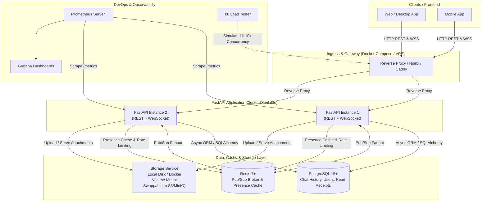
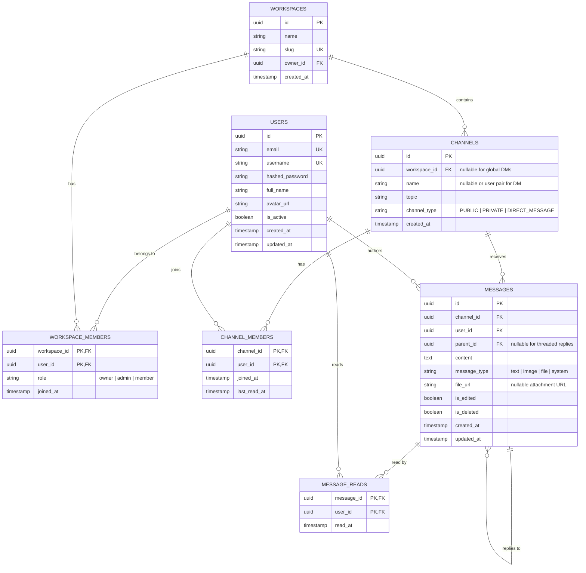
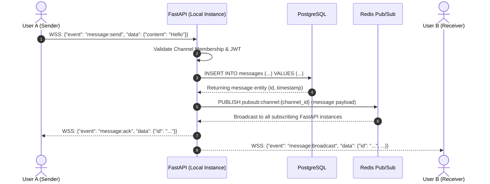

# Master Implementation Plan: Real-Time Live Chat Workspace Platform

> **Target Audience:** AI Coding Agents & Backend Software Engineers
> **Project Name:** Live Chat Workspace Backend
> **Core Framework:** Python 3.11+ / FastAPI (Async)
> **Primary Goal:** High-concurrency, horizontally scalable Slack-like real-time messaging platform
> **Architecture Pattern:** Clean MVC / Hexagonal Layered (Router -> Controller -> Service -> Repository/Model)

---

## 1. System Architecture Overview



---

## 2. Technology Stack & Specifications

| Component | Technology | Specification / Role |
| :--- | :--- | :--- |
| **Runtime & Language** | Python 3.11+ | Native asyncio event loop |
| **Web Framework** | FastAPI (>= 0.110.0) | High-performance ASGI framework |
| **ASGI Server** | Uvicorn (standard) | Multi-worker async server |
| **Database** | PostgreSQL 15+ | Relational persistence via `asyncpg` + SQLAlchemy 2.0 |
| **Cache & Pub/Sub Broker**| Redis 7+ (`redis-py` async) | Channel Pub/Sub, Online/Offline Presence, Caching |
| **Authentication & Security**| JWT (OAuth2 Password Bearer) | `python-jose`, `passlib[bcrypt]` |
| **File / Media Storage** | Local Storage via `StorageService` | Abstract interface storing to `/app/uploads` volume (S3-ready) |
| **Testing (Unit & Integration)** | Pytest + `pytest-asyncio` + `httpx` | Async unit and integration testing |
| **Testing (E2E & Interactive)** | Playwright | Multi-user real-time chat simulation with lightweight web client |
| **Load Testing** | k6 (JavaScript) | Native WebSocket (`k6/ws`) and HTTP high-concurrency benchmarks |
| **Observability** | Prometheus + Grafana | `prometheus-fastapi-instrumentator` |
| **Deployment Target** | Docker Compose on Cloud VPS | AWS EC2 / DigitalOcean / GCP Compute Engine |
| **Legacy Code Policy** | Coexistence | Workshop 5-8 code (`telemetry`, `devices`, `rabbitmq`) kept intact |

---

## 3. Database Schema & Data Models

### 3.1 Entity Relationship Diagram



---

## 4. Message Flow, Redis Cache & Presence Architecture

### 4.1 Message Persistence & Broadcast Flow

To guarantee zero message loss, strict delivery ordering, and reliable message IDs:



### 4.2 Redis Key Schema & TTLs

| Pattern | Type | TTL | Description |
| :--- | :--- | :--- | :--- |
| `presence:user:{user_id}` | String | 60s (sliding) | Value: `"online"`. Refreshed by client heartbeat/ping. |
| `presence:user:{user_id}:meta` | Hash | None | `last_seen`, `device_count`, `custom_status`. |
| `presence:workspace:{workspace_id}:online` | Set | None | Set of active `user_id`s in a workspace. |
| `cache:user:{user_id}` | String (JSON) | 300s | Cached user public profile. |
| `cache:channel:{channel_id}` | String (JSON) | 600s | Cached channel metadata and member list. |

---

## 5. WebSocket & Real-Time Protocol Specification

### 5.1 Endpoint & Handshake
* **Path:** `/api/v1/ws/channels/{channel_id}` (Handles both Group Channels and Direct Messages)
* **Auth:** Query parameter `?token=<jwt_access_token>` or header `Authorization: Bearer <jwt>`.
* **Validation:** Authenticate token; verify sender is in `channel_members`. Close with `4401` or `4403` on failure.

### 5.2 Incoming Client Events

```json
// 1. Send Message
{
  "event": "message:send",
  "data": {
    "content": "Hello team!",
    "parent_id": null,
    "message_type": "text",
    "file_url": null
  }
}

// 2. Mark Messages as Read (Granular Read Receipt)
{
  "event": "message:read",
  "data": {
    "message_ids": ["c1f72a42-7ef4-4f81-9bdf-df554a9d7010"]
  }
}

// 3. Heartbeat
{
  "event": "presence:ping"
}

// 4. Typing Indicator
{
  "event": "typing:start"
}
```

### 5.3 Outgoing Broadcast Events

```json
// 1. Message Broadcast
{
  "event": "message:broadcast",
  "data": {
    "id": "c1f72a42-7ef4-4f81-9bdf-df554a9d7010",
    "channel_id": "8f3b2591-1823-45a0-a7d1-12f5a6b09a01",
    "user": {
      "id": "123e4567-e89b-12d3-a456-426614174000",
      "username": "johndoe",
      "avatar_url": "https://..."
    },
    "content": "Hello team!",
    "created_at": "2026-09-21T07:58:00Z"
  }
}

// 2. Read Receipt Broadcast (Detailed per-user)
{
  "event": "message:read_update",
  "data": {
    "message_id": "c1f72a42-7ef4-4f81-9bdf-df554a9d7010",
    "channel_id": "8f3b2591-1823-45a0-a7d1-12f5a6b09a01",
    "read_by": {
      "user_id": "123e4567-e89b-12d3-a456-426614174000",
      "read_at": "2026-09-21T07:59:15Z"
    }
  }
}

// 3. Presence Update
{
  "event": "presence:update",
  "data": {
    "user_id": "123e4567-e89b-12d3-a456-426614174000",
    "status": "online",
    "last_seen": "2026-09-21T07:58:00Z"
  }
}
```

---

## 6. REST API Endpoints Specification

### 6.1 Authentication (`/api/v1/auth`)
* `POST /api/v1/auth/register` - Register user (`email`, `username`, `password`, `full_name`).
* `POST /api/v1/auth/login` - OAuth2 password login, returns `access_token` and `refresh_token`.
* `POST /api/v1/auth/refresh` - Refresh access token.
* `GET /api/v1/auth/me` - Current user profile.

### 6.2 Workspaces & Channels (`/api/v1/workspaces`, `/api/v1/channels`)
* `POST /api/v1/workspaces` - Create workspace.
* `GET /api/v1/workspaces` - List current user's workspaces.
* `POST /api/v1/workspaces/{id}/channels` - Create channel (PUBLIC or PRIVATE).
* `GET /api/v1/workspaces/{id}/channels` - List channels in workspace.
* `POST /api/v1/channels/direct` - Get or create a 1-on-1 DM channel between two users.
* `POST /api/v1/channels/{id}/members` - Add member to channel.

### 6.3 Messages & Read Receipts (`/api/v1/channels/{channel_id}/messages`)
* `GET /api/v1/channels/{channel_id}/messages` - Paginated message history (cursor-based via `before_id`, default 50).
* `PUT /api/v1/messages/{message_id}` - Edit message.
* `DELETE /api/v1/messages/{message_id}` - Soft delete message (`is_deleted=True`).
* `POST /api/v1/messages/{message_id}/read` - Record read receipt.
* `GET /api/v1/messages/{message_id}/readers` - Get list of users who have read this message.

### 6.4 File & Media Upload (`/api/v1/files`)
* `POST /api/v1/files/upload` - Upload media/attachments (stores to volume, returns URL).
* `GET /api/v1/files/{file_id}` - Serve uploaded file.

### 6.5 Legacy Endpoints (Preserved from Workshops 5-8)
* `/api/v1/health` - System health checks.
* `/api/v1/telemetry` - Legacy telemetry endpoints.
* `/api/v1/devices` - Legacy device status endpoints.

---

## 7. Execution Roadmap & Tasks for AI Implementation

```
[x] Phase 1: Database Entities & Migrations
[x] Phase 2: Security, Authentication & User Management
[ ] Phase 3: Workspace, Channel (Group & DM) & File Storage Services
[ ] Phase 4: Core Real-Time WebSocket & Redis Pub/Sub Distribution
[ ] Phase 5: Presence Engine, Read Receipts & Status Caching
[ ] Phase 6: Automated Testing Suite (Unit, Integration & WS)
[ ] Phase 7: Containerization, CI/CD Pipeline & VPS Docker Compose
[ ] Phase 8: High-Concurrency Load Testing (k6)
[ ] Phase 9: Production Monitoring (Prometheus & Grafana)
```

### Phase 1: Database Entities & Migrations
- [x] Task 1.1: Define SQLAlchemy async models in `app/models/`:
  - `user.py` (enhance existing User model)
  - `workspace.py` (`Workspace`, `WorkspaceMember`)
  - `channel.py` (`Channel` with `channel_type: PUBLIC | PRIVATE | DIRECT_MESSAGE`, `ChannelMember`)
  - `message.py` (`Message` with `parent_id`, `file_url`, `is_deleted`)
  - `message_read.py` (`MessageRead` composite PK `message_id` + `user_id`)
- [x] Task 1.2: Register new models in `app/db/base.py` (without removing `Telemetry`).
- [x] Task 1.3: Generate Alembic migration (`alembic revision --autogenerate -m "add_livechat_models"`).
- [x] Task 1.4: Run migration against PostgreSQL container (`alembic upgrade head`).

### Phase 2: Security, Authentication & User Management
- [x] Task 2.1: Verify & refine JWT token utility in `app/services/security.py`.
- [x] Task 2.2: Implement `get_current_user` in `app/routes/deps.py`.
- [x] Task 2.3: Create Pydantic schemas in `app/schemas/user.py`.
- [x] Task 2.4: Build auth endpoints (`/register`, `/login`, `/me`) in `app/controllers/auth_controller.py`.

### Phase 3: Workspace, Channel (Group & DM) & Storage Services
- [ ] Task 3.1: Create schemas in `app/schemas/workspace.py` and `app/schemas/channel.py`.
- [ ] Task 3.2: Implement `StorageService` interface with `LocalStorageService` saving to `/app/uploads`.
- [ ] Task 3.3: Implement `WorkspaceService` and `ChannelService` (supporting both Group Channels and 1-on-1 DM creation).
- [ ] Task 3.4: Expose REST controllers in `app/controllers/workspace_controller.py`, `channel_controller.py`, and `file_controller.py`.

### Phase 4: Core Real-Time WebSocket & Redis Pub/Sub
- [ ] Task 4.1: Implement `ConnectionManager` in `app/services/connection_manager.py`:
  - Track active client WebSockets by `channel_id` and `user_id`.
  - Handle connection acceptance, disconnect cleanup, and broadcast to local sockets.
- [ ] Task 4.2: Implement `RedisPubSubManager` in `app/services/redis_pubsub.py`:
  - Listen asynchronously to Redis channel patterns (`pubsub:channel:*`).
  - Bridge incoming Redis messages to local `ConnectionManager.broadcast()`.
- [ ] Task 4.3: Implement WebSocket controller in `app/controllers/chat_websocket_controller.py`:
  - Authenticate JWT from query or header on handshake.
  - On `message:send`: Persist message to PostgreSQL first, then publish to Redis Pub/Sub.
  - Send ACK back to sender socket.

### Phase 5: Presence Engine, Read Receipts & Status Caching
- [ ] Task 5.1: Implement `PresenceService` in `app/services/presence_service.py`:
  - Set Redis key `presence:user:{user_id}` on connect/heartbeat.
  - Remove on disconnect, update workspace online set.
- [ ] Task 5.2: Implement Granular Read Receipts:
  - On WS event `message:read`: Insert or ignore into `message_reads` table, publish `message:read_update` via Redis Pub/Sub.
- [ ] Task 5.3: Implement REST endpoint `GET /api/v1/workspaces/{id}/online-users`.

### Phase 6: Automated Testing Suite
- [ ] Task 6.1: Setup test fixtures in `tests/conftest.py` (async DB session, async Redis client).
- [ ] Task 6.2: Write tests for Auth, Workspaces, and Channels in `tests/test_chat_services.py`.
- [ ] Task 6.3: Write WebSocket integration test with `httpx` / `TestClient.websocket_connect` in `tests/test_websocket.py`.
- [ ] Task 6.4: Build Lightweight HTML Chat Test Client in `tests/e2e/client.html` (minimal UI with auth, channel switch, real-time message stream, typing indicator, and read receipt triggers).
- [ ] Task 6.5: Implement Playwright E2E interactive test suite in `tests/e2e/test_chat_e2e.py`:
  - Spin up 2 isolated browser contexts (User A and User B).
  - Verify bidirectional real-time message broadcast, online presence updates, and typing indicators.


### Phase 7: Containerization, CI/CD Pipeline & VPS Docker Compose
- [ ] Task 7.1: Create optimized multi-stage `Dockerfile` (non-root user, volume mount for `/app/uploads`).
- [ ] Task 7.2: Create production `docker-compose.yml` defining:
  - `postgres` (with persistent volume)
  - `redis` (with persistent volume)
  - `api` (FastAPI app)
  - `nginx` (reverse proxy for HTTP & WebSocket SSL termination)
- [ ] Task 7.3: Create `.github/workflows/ci.yml` for automated linting, test execution, and Docker build check.

### Phase 8: High-Concurrency Load Testing (k6)
- [ ] Task 8.1: Create `tests/load_testing/ws_stress_test.js`:
  - Simulate 1,000 to 10,000 concurrent WebSocket connections using `k6/ws`.
  - Simulate continuous chat message exchanges and measure p95 / p99 delivery latency.
- [ ] Task 8.2: Create `tests/load_testing/http_load_test.js`:
  - Measure message history retrieval throughput under load.
- [ ] Task 8.3: Document benchmark metrics, bottlenecks, and server tuning guidelines.

### Phase 9: Production Monitoring (Prometheus & Grafana)
- [ ] Task 9.1: Instrument FastAPI with `prometheus-fastapi-instrumentator` exposing `/metrics`.
- [ ] Task 9.2: Implement custom Prometheus metrics:
  - `livechat_active_websocket_connections` (Gauge)
  - `livechat_messages_processed_total` (Counter)
  - `livechat_db_query_duration_seconds` (Histogram)
- [ ] Task 9.3: Add `docker-compose.monitoring.yml` with Prometheus and Grafana.
- [ ] Task 9.4: Provide pre-built Grafana dashboard JSON displaying active connections, throughput, and latency.

---

## 8. AI Agent Execution Directives & Conventions

1. **Phase Branch Workflow:** When working on any phase branch (`feature/phase-X-*`), the AI Agent must read `PHASE.md` in the workspace root first as the primary task scope, deliverables definition, and execution checklist for that specific phase.
2. **Strict Async Paradigm:** All database queries must use SQLAlchemy 2.0 async syntax (`await session.execute(...)`), never synchronous blocking calls.
3. **Redis Async Operations:** Always use `aioredis` / async client (`await redis.get(...)`).
4. **No Breaking Changes to Workshop Code:** Do not remove `telemetry` or `devices` modules/migrations; keep them coexisting.
5. **Error Handling Standards:**
   - Raise FastAPI `HTTPException` with explicit status codes.
   - For WebSockets, send JSON error envelopes or standard close codes before terminating.
6. **Code Style & Quality:**
   - Strict typing with type hints (`typing.Optional`, `typing.List`, or Python 3.10+ union types `X | None`).
   - All code must pass `flake8`, `black`, and `isort` linting without errors.
7. **Task Progression:** Mark completed tasks with `[x]` in both `plan.md` and `PHASE.md` as each task is implemented and verified.
